Here’s a roadmap of 10 Rust assignments (projects) that go from basic to advanced.  
If you implement them seriously, you will touch essentially every core topic in the language and be comfortable designing real-world Rust software.

---

## 0. Main topics you should eventually master

From the Rust book’s structure, the main topics are:【turn2fetch0】【turn3fetch0】

- Syntax basics: variables, functions, control flow, basic types【turn2fetch0】
- Ownership, borrowing, slices (the core of Rust’s memory model)【turn2fetch0】
- Structs, enums, pattern matching【turn2fetch0】
- Packages, crates, modules, visibility【turn2fetch0】
- Collections: `Vec`, `String`, `HashMap`【turn2fetch0】
- Error handling: `Result`, `Option`, `panic!` vs recoverable errors【turn2fetch0】
- Generics, traits, lifetimes【turn2fetch0】
- Testing and organization【turn2fetch0】
- Iterators and closures【turn2fetch0】
- Smart pointers: `Box`, `Rc`, `RefCell`, `Drop`, etc.【turn3fetch0】
- Concurrency: threads, message passing, `Send`/`Sync`【turn3fetch0】
- Async programming: `async`/`await`, futures, streams, runtimes【turn3fetch0】【turn4search0】
- Advanced traits, types, macros, unsafe Rust【turn3fetch0】

The 10 assignments below are designed to hit all of these in a gradual way.

---

## Overview of the 10 assignments (difficulty curve)

```mermaid
flowchart LR
  A[1. Number guessing game] --> B[2. CLI todo list]
  B --> C[3. Text file indexer]
  C --> D[4. Custom collection type]
  D --> E[5. Simple key-value store]
  E --> F[6. Thread-safe job queue]
  F --> G[7. Async web client]
  G --> H[8. Mini actor framework]
  H --> I[9. Protocol + binary codec]
  I --> J[10. Multi-threaded async server]
```



---

## Assignment 1 – Number guessing game (basics & ownership warm-up)

**Goal:** Build a simple “guess the number” game in the terminal.

**What you must implement:**

1. Program generates a random integer between 1 and 100.
2. User is prompted to input a guess.
3. After each guess, program prints:
   - “Too small”
   - “Too big”
   - “Correct!” and exits.
4. Limit the number of attempts (e.g., 7). If the user fails, reveal the number.

**Topics you will practice:**

- Basic syntax: functions, variables, control flow (`loop`, `if`, `match`).【turn2fetch0】
- Input/output with `std::io`.
- Basic error handling: `Result`, `expect`, `?`.
- Ownership: moving values between functions, using references.

**Success criteria:**

- Program compiles and runs without warnings.
- Game loop is correct and doesn’t panic on bad input.
- You can explain why each function takes arguments by reference or by value.

---

## Assignment 2 – CLI todo list (structs, collections, modules)

**Goal:** A command-line todo list manager with basic persistence.

**What you must implement:**

1. Support commands via command-line arguments:
   - `add <task>`
   - `list`
   - `done <id>`
   - `remove <id>`
2. Store tasks in a `Vec` or `HashMap` with:
   - `id` (integer or string)
   - `title`
   - `done` status.
3. Optionally persist tasks to a JSON file (using `serde_json`).
4. Organize code into modules, e.g., `todo`, `storage`, `cli`.

**Topics you will practice:**

- Structs and methods.【turn2fetch0】
- Collections: `Vec`, `String`, optionally `HashMap`.【turn2fetch0】
- Modules and visibility (`mod`, `pub`, `use`).【turn2fetch0】
- Basic error handling with `Result` and `Box<dyn Error>`.
- External crates (`serde`, `serde_json`, `clap` or similar).

**Success criteria:**

- Adding, listing, marking done, and removing tasks works.
- You can explain how tasks are stored in memory and (optionally) serialized.
- You understand why `Todo` fields are `String` vs `&str`.

---

## Assignment 3 – Text file indexer (ownership, slices, error handling)

**Goal:** A small tool that indexes words in text files.

**What you must implement:**

1. Read a text file passed as argument.
2. Split text into words (simple whitespace/punctuation split).
3. Build a word → list of line numbers mapping.
4. Print the index sorted by word.

Example output:

```text
apple: 1, 3
banana: 2, 4
```

**Topics you will practice:**

- Ownership and borrowing in realistic functions.【turn2fetch0】
- String slices (`&str`) vs owned `String`.
- `HashMap` and entry API.
- File I/O and error handling with `Result`.
- Iterators and basic closures.

**Success criteria:**

- No unnecessary cloning; you can justify each `.clone()`.
- You can explain why some functions return `String` and others `&str`.
- You handle file-open errors gracefully (no panic on missing file).

---

## Assignment 4 – Custom generic collection type (generics, traits, iterators)

**Goal:** Implement your own generic container and iterator.

**What you must implement:**

1. A generic `Stack<T>` type backed by a `Vec<T>`.
2. Methods:
   - `new`
   - `push`
   - `pop`
   - `peek` (returns an optional reference to the top)
3. Implement:
   - `IntoIterator` for `&Stack<T>` and `Stack<T>`.
   - An iterator type that yields `&T` or `T` as appropriate.
4. Implement a trait `Describe` for `Stack<T>`:
   - `fn describe(&self) -> String` returning something like `"Stack with N elements"`.

**Topics you will practice:**

- Generics and trait bounds.【turn2fetch0】
- Associated types in traits (iterator).
- Implementing traits from the standard library (`Iterator`, `IntoIterator`).
- Lifetimes on iterator implementations.

**Success criteria:**

- `Stack<i32>`, `Stack<String>`, etc. compile and work.
- You can iterate over a stack with `for x in &stack { ... }`.
- You can explain where lifetime parameters appear and why.

---

## Assignment 5 – Simple on-disk key-value store (lifetimes, errors, design)

**Goal:** A persistent key-value store that writes to disk.

**What you must implement:**

1. A `KeyValueStore` type that:
   - Stores key-value pairs in a `HashMap` in memory.
   - Writes them to a file on disk after each modification.
   - On start, loads the file into the `HashMap`.
2. Support operations:
   - `insert(key, value)`
   - `get(key) -> Option<&value>`
   - `remove(key)`
3. Use a simple format like JSON or your own text format.
4. Define your own error enum and implement `From<io::Error>` etc.

**Topics you will practice:**

- Lifetimes in method signatures (`get` returning a reference).
- Error handling design: custom error type, `impl From`.
- File I/O and data serialization.
- Designing a small API with good documentation comments.

**Success criteria:**

- Inserting, getting, and removing keys works across program restarts.
- You can explain why `get` takes `&self` and returns `Option<&'a str>` (or similar).
- You can justify your choice of format and error-handling strategy.

---

## Assignment 6 – Thread-safe job queue (concurrency, smart pointers)

**Goal:** A multi-threaded job executor.

**What you must implement:**

1. A `JobQueue` type that holds closures `FnOnce() + Send + 'static`.
2. A fixed-size thread pool that:
   - Spawns N worker threads.
   - Workers pull jobs from the queue and execute them.
3. Support:
   - `submit(job)` to add jobs.
   - `graceful_shutdown()` that waits for all pending jobs to finish.

Use `std::sync::mpsc` channels or similar for communication.【turn3fetch0】

**Topics you will practice:**

- Threads and message passing (channels).【turn3fetch0】
- `Arc`, `Mutex`, and `Send` trait.
- `Box<dyn FnOnce() + Send + 'static>`.
- Smart pointers and `Drop` for cleanup.

**Success criteria:**

- Jobs submitted are actually executed by worker threads.
- No data races; you can explain why `Arc<Mutex<...>>` is needed.
- You can explain how you prevent threads from panicking in a way that crashes the whole pool.

---

## Assignment 7 – Async web client (async/await, futures, error handling)

**Goal:** An async command-line HTTP client.

**What you must implement:**

1. Use `reqwest` or similar async HTTP client crate.
2. Implement a CLI that:
   - Takes a URL.
   - Fetches the URL.
   - Prints:
     - Status code
     - All headers
     - The body.
3. Support:
   - Configurable timeout.
   - Multiple URLs sequentially, then concurrently.
4. Use a runtime like `tokio` or `async-std`.

**Topics you will practice:**

- `async fn`, `.await`, futures.【turn4search0】
- Async runtimes and tasks.
- Async error handling with `Result`.
- Concurrency: `join`, `join_all`, or similar.

**Success criteria:**

- You can fetch URLs concurrently and see total time reduction.
- You can explain the difference between threads and async tasks.
- You understand why `reqwest::get` returns a `Future`.

---

## Assignment 8 – Mini actor framework (traits, advanced concurrency, design)

**Goal:** A small actor-style system where “actors” process messages.

**What you must implement:**

1. Define a `Message` trait.
2. Define an `Actor` trait:
   - `fn handle(&mut self, msg: Box<dyn Message>)`.
3. An `ActorSystem` that:
   - Spawns a thread per actor.
   - Gives each actor a message queue (channel).
   - Routes messages to actors.
4. Implement at least two actor types:
   - One that keeps a counter.
   - One that logs messages to a file.

**Topics you will practice:**

- Trait objects (`dyn Actor`, `dyn Message`).
- Advanced concurrency with channels and threads.【turn3fetch0】
- Designing a small framework with a clean API.
- Implementing `Drop` to cleanly shut down actors.

**Success criteria:**

- You can send messages to actors from multiple threads.
- Each actor processes messages one by one in its own thread.
- You can explain how you avoid races and deadlocks.

---

## Assignment 9 – Binary protocol and codec (advanced types, unsafe, FFI optional)

**Goal:** Implement a binary protocol and a codec.

**What you must implement:**

1. Design a simple binary protocol, e.g.:
   - Request: `[method_id: u8, payload_len: u32, payload: bytes]`
   - Response: `[status: u8, payload_len: u32, payload: bytes]`
2. Implement:
   - A `Encoder` that turns a Rust struct into `Vec<u8>`.
   - A `Decoder` that turns `&[u8]` back into the struct.
3. Use `#[repr(C)]` and/or byteorder crates.
4. Optionally add:
   - `unsafe` code to interpret bytes as a struct.
   - A small C program that talks to your Rust codec via FFI.

**Topics you will practice:**

- Advanced types and representation (`#[repr(C)]`).
- Bit manipulation and endianness.
- `unsafe` Rust and FFI (optional).【turn3fetch0】
- Testing a low-level component with unit tests.

**Success criteria:**

- You can encode and decode a struct without losing data.
- You can explain why alignment and endianness matter.
- If you use `unsafe`, you can explain why it is sound.

---

## Assignment 10 – Multi-threaded async server (final integration project)

**Goal:** A multi-threaded async server (e.g., a simple key-value store over TCP or HTTP).

**What you must implement:**

1. Use an async runtime (`tokio` or `async-std`).
2. Implement a TCP or HTTP server that:
   - Accepts connections concurrently.
   - Parses a simple protocol (text or binary).
3. Implement a key-value store:
   - `SET key value`
   - `GET key`
   - `DEL key`
4. Use a thread-safe, async-friendly data structure:
   - `Arc<AsyncMutex<HashMap<String, String>>>` or similar.
5. Support:
   - Graceful shutdown.
   - Logging of commands.

This mirrors the style of the book’s final project: a multithreaded web server.【turn3fetch0】

**Topics you will practice:**

- Async networking and server design.【turn4search0】
- Combining threads and async (multi-threaded runtime).
- Shared state with `Arc` and async mutexes.
- Testing an async server with integration tests.
- Overall system design and configuration.

**Success criteria:**

- You can connect multiple clients concurrently and perform operations.
- The server remains responsive under load.
- You can explain how you structured your code and why you chose certain abstractions.

---

## How to use this roadmap effectively

- **Do assignments in order.** Each one introduces new concepts and relies on the previous.
- **Use the Rust book** as reference: each assignment aligns with one or more chapters.【turn2fetch0】【turn3fetch0】
- **Write tests early** (at least from Assignment 2 onward).
- **Avoid `unwrap`/`expect` in final versions**; handle errors properly.
- **Document your design** and trade-offs: this is part of becoming a strong Rust engineer.

If you implement all 10 projects and truly understand the design decisions you made, you will be comfortable with Rust’s syntax, ownership system, generics, traits, concurrency, async, and more — enough to design and implement serious Rust software.